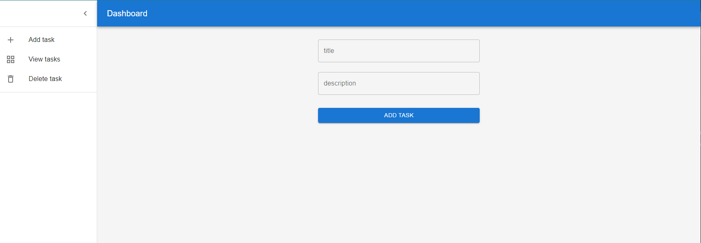
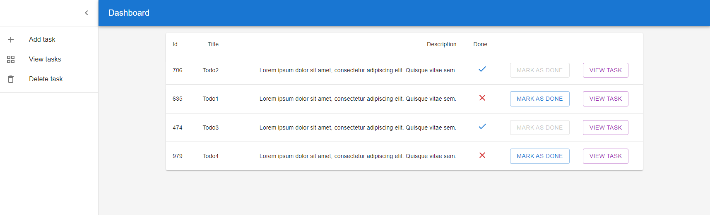
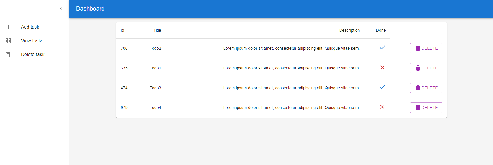
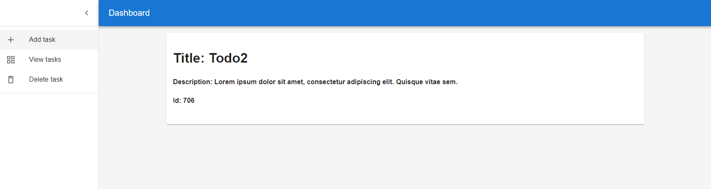

# Todo App

## Authors

- [Pavel Calin](https://github.com/CalinPavel)

# Acknowledgements

Create a web-app in which the user can add todos. The app should have 4 pages:

 - a page for adding todos
 - a page for viewing todos
 - a page for deleting todos by their id
 - a page for viewing a single todo (read the todo id from the url or from an input on the page)
The todo object should contain:

## API Reference

The todos will come from the API presented at the course, similar to this one: https://github.com/xrusu/todo-api-nest.

## Screenshots

